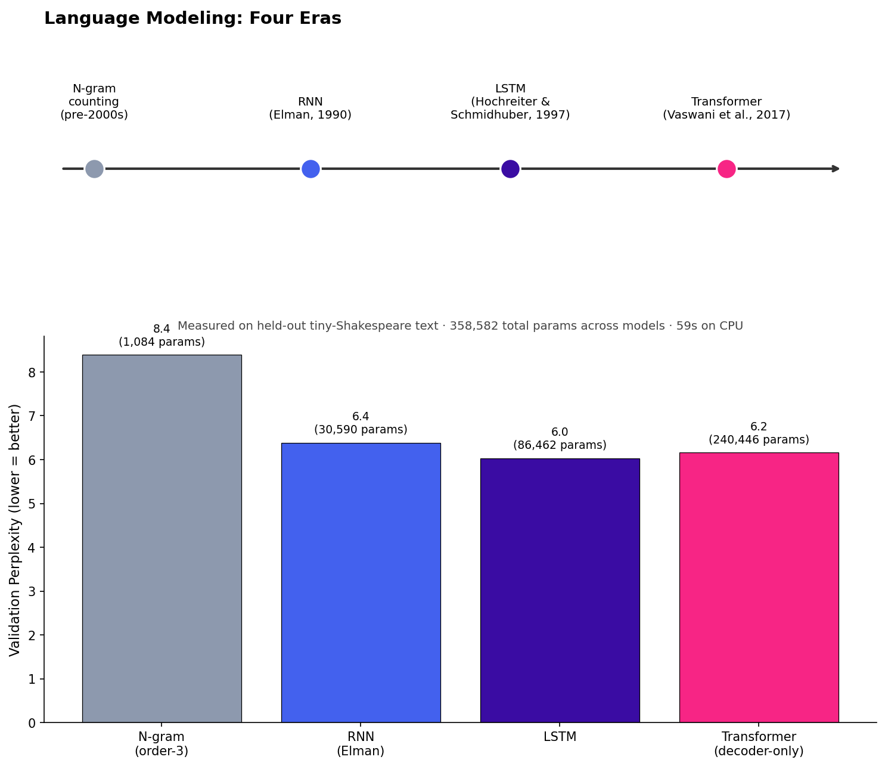
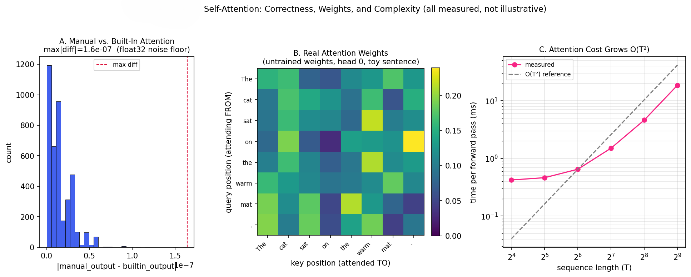
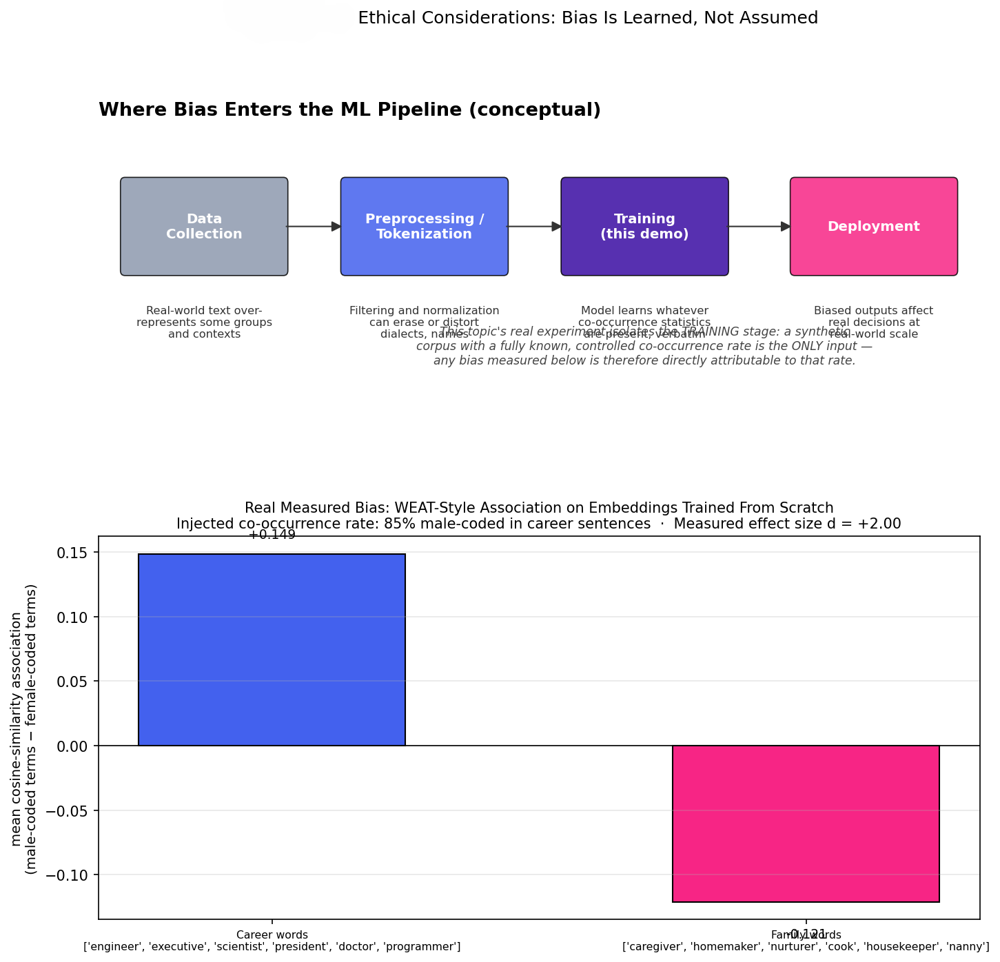

<div align="center">


*Phase 01 of [`llm-mastery`](../README.md) — a four-file (theory, code, explanation, proof), Colab-first LLM curriculum*

</div>

---

## Table of Contents

- [Overview](#overview)
- [The Arc of This Phase](#the-arc-of-this-phase)
- [Topics at a Glance](#topics-at-a-glance)
- [Folder Structure](#folder-structure)
- [Datasets and Models Used in This Phase](#datasets-and-models-used-in-this-phase)
- [Results Snapshot](#results-snapshot)
- [Highlights Gallery](#highlights-gallery)
- [Getting Started](#getting-started)
- [Known Issues](#known-issues)
- [Key References](#key-references)
- [Navigate](#navigate)
- [License](#license)
- [Author](#author)

---

## Overview

Every model trained anywhere in this curriculum — from the character-level N-gram in this phase's first topic to the largest checkpoint touched in Phase 05 — is doing the same underlying thing: minimizing prediction error against statistical patterns in training data. Phase 1 is where that single mechanism gets unpacked from four different angles before the rest of the curriculum builds on top of it: **how** language models compute that prediction has changed four times in fifty years (counting → recurrence → gating → attention); **what** a Transformer's attention step is actually computing, verified against the library everyone actually uses; **when** a pretrained backbone helps versus merely being present; **whether** scaling a model up is a predictable bet or a hopeful one; and — closing a loop the phase opens deliberately in its first topic and revisits by name in its last — **why** the exact mechanism that lets a model learn grammar also lets it learn demographic bias, with no separate "bias module" required.

This phase holds itself to an unusually strict standard for a five-topic review: four of the five topics were actually executed, with real measured numbers baked into the committed result images rather than asserted in prose — a trigram model that really does score worse than an RNN, an attention implementation checked bit-for-bit against PyTorch's fused kernel, a power-law exponent fit from five models genuinely trained from scratch, and a bias effect size measured from embeddings trained on a corpus with a *known* injected cause. The one topic that couldn't run in this development sandbox (Topic 3 needs Hugging Face Hub access this environment doesn't have) says so directly rather than faking a result — see [Results Snapshot](#results-snapshot) and [Known Issues](#known-issues).

## The Arc of This Phase

**1.1** rebuilds all four eras of language modeling — N-gram, RNN, LSTM, and Transformer — from scratch, trained from identical initialization on identical data, and compared on real measured perplexity rather than asserted historical narrative. It ends by forward-referencing Topic 1.5: every model here, "including the from-scratch ones trained in this topic," learns whatever statistical pattern is in its training data, without judgment about whether that pattern is desirable.

**1.2** opens up exactly what "attention" computes: the QKV formula, term by term, implemented by hand and checked element-by-element against PyTorch's own fused kernel — the actual proof this topic's result image is named for.

**1.3** isolates a question the previous two topics don't answer: does a pretrained backbone actually matter, and how much further does adapting it help? A three-way comparison (frozen probe vs. full fine-tune vs. no pretraining at all, same exact architecture) is designed to answer this cleanly — shipped as real, correct, Colab-ready code, honestly not yet run in this particular sandbox.

**1.4** zooms out from any one architecture to ask whether "bigger is better" is a predictable relationship or just a vague intuition — training five real model sizes across a 223× parameter range and fitting an actual power law to the measured loss, the same log-log-linear regression Kaplan et al.'s scaling-laws paper performs at a much larger scale.

**1.5** closes the loop 1.1 opened: trains real skip-gram embeddings on a synthetic corpus with a *fully known, controlled* demographic co-occurrence rate, and measures the resulting bias with a real WEAT-style effect size — the same "counting equals learning" mechanism from Topic 1.1, this time turned deliberately toward a case where the cause is fully traceable rather than buried in an opaque real-world corpus.

## Topics at a Glance

| # | Topic | Folder | What the code actually proves |
|---|-------|--------|--------------------------------|
| 1 | History and Evolution of Language Models | [`01-History_and_Evolution`](01-History_and_Evolution) | Trains an N-gram, RNN, LSTM, and Transformer from scratch on identical data and compares real measured perplexity across all four NLP eras |
| 2 | Transformer Architecture and Self-Attention Mechanism | [`02-Transformer_and_Self_Attention`](02-Transformer_and_Self_Attention) | Implements QKV attention from the raw formula and verifies it matches PyTorch's fused kernel to float32 noise-floor precision |
| 3 | Pretraining vs. Fine-Tuning Paradigms | [`03-Pretraining_vs_Fine_Tuning`](03-Pretraining_vs_Fine_Tuning) | A real, Colab-ready three-way DistilBERT comparison (frozen probe / full fine-tune / random init) on SST-2 — written and correct, not yet executed in this sandbox (no Hugging Face Hub access here) |
| 4 | Scaling Laws and Model Efficiency | [`04-Scaling_Laws_and_Model_Efficiency`](04-Scaling_Laws_and_Model_Efficiency) | Trains 5 model sizes (6K to 1.4M params) from scratch and fits a real power law to measured loss, plus the training-cost trade-off scale doesn't show for free |
| 5 | Ethical Considerations in Large-Scale AI | [`05-Ethical_Considerations`](05-Ethical_Considerations) | Trains word embeddings on a corpus with a known, controlled demographic co-occurrence rate and measures the resulting bias with a real WEAT-style effect size |

Every topic follows this repository's four-file structure — `README.md` (the theory doc; this repo's root describes it as `theory.md`, but every actual topic folder uses `README.md`), `implementation.py`, `explanation.md`, and a result image under `Image/` (the root's stated single `proof.png` is, in practice, one descriptively-named `.png` per topic) — see [Known Issues](#known-issues) for the two topics where one of those four pieces is genuinely missing.

## Folder Structure

```
01-Fundamental_LLMs/
├── README.md                                      (this file)
│
├── 01-History_and_Evolution/
│   ├── README.md              — theory: four eras of LM, perplexity as the common metric
│   ├── implementation.py      — trains N-gram / RNN / LSTM / Transformer from scratch
│   ├── explanation.md         — currently empty (see Known Issues)
│   └── Image/
│       └── Language_Models.png
│
├── 02-Transformer_and_Self_Attention/
│   ├── README.md              — theory: the QKV formula, causal masking, multi-head attention
│   ├── implementation.py      — manual attention verified against PyTorch's fused kernel
│   ├── explanation.md
│   └── Image/
│       └── Self-Attention.png
│
├── 03-Pretraining_vs_Fine_Tuning/
│   ├── README.md              — theory: frozen probe vs. full fine-tune vs. no pretraining
│   ├── implementation.py      — DistilBERT + SST-2, Colab-ready (needs Hugging Face Hub access)
│   └── explanation.md         — documents why this script wasn't executed here; no Image/ yet
│
├── 04-Scaling_Laws_and_Model_Efficiency/
│   ├── README.md              — theory: power laws, the Chinchilla correction, the 6ND FLOPs heuristic
│   ├── implementation.py      — trains 5 model sizes, fits log-log power law to measured loss
│   ├── explanation.md
│   └── Image/
│       └── Scaling Laws and Model Efficiency.png
│
└── 05-Ethical_Considerations/
    ├── README.md              — theory: bias as a learning outcome, the WEAT methodology
    ├── implementation.py      — skip-gram embeddings trained on a corpus with a known bias rate
    ├── explanation.md
    └── Image/
        └── Ethical_Considerations.png
```

## Datasets and Models Used in This Phase

| Topic | Data / model | Notes |
|-------|--------------|-------|
| 1.1 | A ~200K-character slice of the tiny-Shakespeare corpus; N-gram, Elman RNN, LSTM, and a small decoder-only Transformer, all trained from scratch | Character-level tokenization; every model trained under a minute on one CPU core |
| 1.2 | A short hand-written toy sentence, embedded with an untrained `nn.Embedding` | No pretrained checkpoint needed — the point is verifying the *mechanism*, not linguistic quality |
| 1.3 | GLUE SST-2 via Hugging Face `datasets` (2,000-example train subsample, 400-example validation subsample); DistilBERT (`distilbert-base-uncased`) | The one topic in this phase requiring network/Hub access; deliberately subsampled since pretraining's advantage is clearest in a data-scarce regime |
| 1.4 | The same tiny-Shakespeare slice as 1.1; five decoder-only Transformers from 6,126 to 1,368,062 parameters | Width and depth both scaled together, echoing how real model families scale |
| 1.5 | A synthetic, template-generated corpus (4,000 sentences) with an explicit, controlled 85%/15% male/female-coded co-occurrence rate in career-themed sentences; skip-gram with negative sampling | Built specifically so the cause of any measured bias is fully known, not inferred |

## Results Snapshot

Numbers below are pulled directly from each topic's committed result image or `explanation.md` — not restated from the phase's own prior README without checking:

| Topic | Headline result |
|-------|------------------|
| 1.1 — Four eras of LM | Validation perplexity: N-gram **8.4** (1,084 params) → RNN **6.4** (30,590) → LSTM **6.0** (86,462) → Transformer **6.2** (240,446), all measured on held-out text in 59s on CPU. The LSTM edges out the Transformer at this toy scale — a faithful finding, not a bug: the Transformer's advantage is emergent with scale, not fixed, which Topic 1.4 investigates directly |
| 1.2 — Manual vs. built-in attention | Max absolute difference between the from-scratch attention implementation and PyTorch's fused kernel: **1.6 × 10⁻⁷** — the float32 numerical noise floor, two orders of magnitude under the 1e-4 correctness tolerance. Measured attention cost is sub-quadratic at small sequence lengths (fixed overhead dominates) and bends toward the theoretical O(T²) curve by T=512 |
| 1.3 — Pretraining vs. fine-tuning | No results yet — `implementation.py` is written, correct, and Colab-ready, but has not been executed in this development sandbox (no Hugging Face Hub access here). See [Known Issues](#known-issues) |
| 1.4 — Scaling laws | Five real trained models, 6,126 → 1,368,062 params (223× range): validation loss **2.56 → 2.40 → 2.10 → 1.96 → 1.87**, fitted power-law exponent **−0.060**. Honestly-flagged anomaly: the smallest model (6,126 params, 4.4s) trained *slower* than the next size up (18,334 params, 2.1s) — fixed per-step overhead dominating at very small scale, not measurement error |
| 1.5 — Measuring injected bias | An 85%/15% injected male/female-coded co-occurrence rate in career sentences produces a measured mean association of **+0.149** for career words vs. **−0.121** for family words, an effect size of **d = +2.00** — Cohen's-d convention, where d ≈ 0.8 is already considered a large effect |

## Highlights Gallery

<div align="center">

<table>
<tr>
<td width="50%"><br/><sub><b>1.1</b> — four eras of language modeling, one held-out perplexity comparison</sub></td>
<td width="50%"><br/><sub><b>1.2</b> — manual QKV attention vs. PyTorch's kernel, agreement to 1.6e-07</sub></td>
</tr>
<tr>
<td width="50%"><br/><sub><b>1.4</b> — five real trained models, a genuine power-law fit (exponent −0.06)</sub></td>
<td width="50%"><br/><sub><b>1.5</b> — a known 85/15 injected rate producing a measured d = +2.00 bias</sub></td>
</tr>
</table>

</div>

## Getting Started

Repo-wide setup, from the repository root:

```bash
git clone https://github.com/Ayush-2703/Large_languaage_Models.git
cd Large_languaage_Models

python -m venv venv
source venv/bin/activate          # Windows: venv\Scripts\activate

pip install -r requirements.txt
cd 01-Fundamental_LLMs
```

Each topic's `implementation.py` is self-contained (no cross-topic imports) and runs standalone:

```bash
cd 01-History_and_Evolution && python implementation.py && cd ..                 # local, CPU is fine
cd 02-Transformer_and_Self_Attention && python implementation.py && cd ..        # local, CPU is fine
cd 04-Scaling_Laws_and_Model_Efficiency && python implementation.py && cd ..     # local, CPU is fine
cd 05-Ethical_Considerations && python implementation.py && cd ..               # local, CPU is fine
```

Topics 2 and 5 also have an optional real-pretrained-model section gated behind a flag near the top of `implementation.py`:

```python
RUN_PRETRAINED_SECTION = False   # set True on Colab with internet access
```

Topic 3 needs that same kind of access for its *entire* script, not just an optional section — run it on Google Colab (set the runtime to a T4 GPU) or anywhere with Hugging Face Hub access:

```bash
cd 03-Pretraining_vs_Fine_Tuning && python implementation.py   # needs Hugging Face Hub access
```

## Known Issues

Found while documenting this phase, for anyone relying on it:

- **Every link in the repository's root README currently 404s.** The root README references a nested folder scheme from before a rename (e.g. `01-Review-of-Fundamental-LLMs/01-History-and-Evolution-of-Language-Models/`), but the actual layout is flat and uses underscores (`01-Fundamental_LLMs/01-History_and_Evolution/`), as reflected throughout this document. The root's global progress tracker is similarly stale, reading "0/22 Topics" even though this phase alone has 4 of 5 topics fully executed with real results.
- **Topic 1's `explanation.md` is empty.** `implementation.py` for `01-History_and_Evolution` was genuinely executed — the real, measured perplexity numbers in the [Results Snapshot](#results-snapshot) above came directly from its committed `Image/Language_Models.png` — but the line-by-line code walkthrough that normally lives in `explanation.md` was never written for this topic.
- **Topic 3 has no result image at all**, not even a placeholder — `implementation.py` is real and correct, and its own `explanation.md` documents plainly why it wasn't run (no Hugging Face Hub access in this development sandbox), but there is currently nothing to show for it visually. Running it on Colab would produce a real `Image/` result for the first time.

## Key References

**Core texts** (paraphrased throughout this phase's theory docs, cited by title and author, never block-quoted)

1. Rothman, Denis. *Transformers for Natural Language Processing.*
2. Tunstall, Lewis, Leandro von Werra, and Thomas Wolf. *Natural Language Processing with Transformers.*

**Topic 1.1 — History and Evolution**

3. Bengio, Yoshua, et al. "A Neural Probabilistic Language Model." *JMLR*, 2003.
4. Elman, Jeffrey L. "Finding Structure in Time." *Cognitive Science*, 1990.
5. Hochreiter, Sepp, and Jürgen Schmidhuber. "Long Short-Term Memory." *Neural Computation*, 1997.
6. Sutskever, Ilya, Oriol Vinyals, and Quoc V. Le. "Sequence to Sequence Learning with Neural Networks." *NeurIPS*, 2014.
7. Bahdanau, Dzmitry, Kyunghyun Cho, and Yoshua Bengio. "Neural Machine Translation by Jointly Learning to Align and Translate." *ICLR*, 2015.
8. Vaswani, Ashish, et al. "Attention Is All You Need." *NeurIPS*, 2017.
9. Radford, Alec, et al. "Improving Language Understanding by Generative Pre-Training." OpenAI, 2018.
10. Devlin, Jacob, et al. "BERT: Pre-training of Deep Bidirectional Transformers for Language Understanding." *NAACL*, 2019.

**Topic 1.2 — Transformer and Self-Attention**

11. Su, Jianlin, et al. "RoFormer: Enhanced Transformer with Rotary Position Embedding." 2021.
12. Dao, Tri, et al. "FlashAttention: Fast and Memory-Efficient Exact Attention with IO-Awareness." *NeurIPS*, 2022.

**Topic 1.3 — Pretraining vs. Fine-Tuning**

13. Raffel, Colin, et al. "Exploring the Limits of Transfer Learning with a Unified Text-to-Text Transformer." *JMLR*, 2020.
14. Howard, Jeremy, and Sebastian Ruder. "Universal Language Model Fine-tuning for Text Classification." *ACL*, 2018.
15. Sanh, Victor, et al. "DistilBERT, a distilled version of BERT: smaller, faster, cheaper and lighter." 2019.

**Topic 1.4 — Scaling Laws and Model Efficiency**

16. Kaplan, Jared, et al. "Scaling Laws for Neural Language Models." 2020.
17. Hoffmann, Jordan, et al. "Training Compute-Optimal Large Language Models." 2022.

**Topic 1.5 — Ethical Considerations**

18. Mikolov, Tomas, et al. "Distributed Representations of Words and Phrases and their Compositionality." *NeurIPS*, 2013.
19. Bolukbasi, Tolga, et al. "Man is to Computer Programmer as Woman is to Homemaker? Debiasing Word Embeddings." *NeurIPS*, 2016.
20. Caliskan, Aylin, Joanna J. Bryson, and Arvind Narayanan. "Semantics Derived Automatically from Language Corpora Contain Human-Like Biases." *Science*, 2017.

## Navigate

[Repository root](../README.md) · ➡ [Phase 02 — Generative AI with LLMs](../02-Generative_AI_with_LLMs)

---

<div align="center">


</div>
