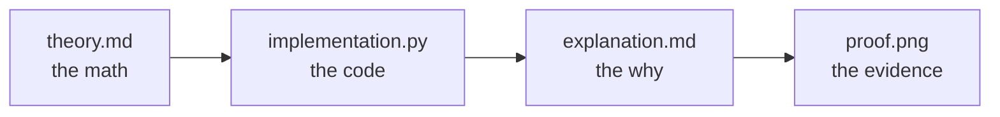
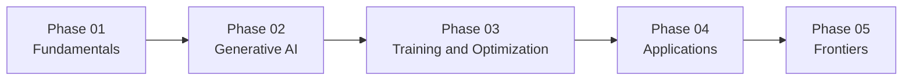

<div align="center">


<picture>
  <source media="(prefers-color-scheme: dark)" srcset="https://readme-typing-svg.demolab.com/?font=Fira+Code&size=20&duration=2800&pause=900&color=C4B5FD&center=true&vCenter=true&width=600&lines=22+Topics,+5+Phases,+One+Repo;Theory,+Code,+Explanation,+Proof;Every+Script+Runs+on+a+Free+T4;Small+Models.+Full+Understanding." />
  
</picture>

[](LICENSE)
[](https://www.python.org/)
[](https://pytorch.org/)
[](https://huggingface.co/docs/transformers)
[](https://colab.research.google.com/)

[](#progress-tracker)
[](#progress-tracker)
[](https://github.com/Ayush-2703/llm-mastery/commits/main)

[](https://github.com/Ayush-2703/llm-mastery/stargazers)
[](https://github.com/Ayush-2703/llm-mastery/network/members)

</div>

Twenty-two topics. Five phases. One free-tier Colab T4 GPU per topic, under an hour each. This is a hands-on curriculum for the full arc of large language models, from the QKV math inside self-attention through RAG pipelines, DPO alignment, and multimodal frontiers. Every topic ships runnable code and a generated proof that it actually ran.

## Table of Contents

- [About](#about)
- [The Four-File Promise](#the-four-file-promise)
- [Design Philosophy](#design-philosophy)
- [Curriculum](#curriculum)
- [Repository Structure](#repository-structure)
- [Scope Notes](#scope-notes)
- [Getting Started](#getting-started)
- [Progress Tracker](#progress-tracker)
- [Who This Is For](#who-this-is-for)
- [References](#references)
- [Author](#author)
- [License](#license)

---

## About

This repository covers large language models end to end across five phases and twenty-two topics: architectural fundamentals, generative fine-tuning, efficient training and alignment, applied systems like RAG, and where the field is headed next.

It's being built incrementally, phase by phase. The folder skeleton below is complete; the `theory.md`, `implementation.py`, `explanation.md`, and `proof.png` for each topic ship in subsequent passes, tracked in that folder's own `STATUS.md`.

Built to the same standard as its companion repository, [`deep-learning-mastery`](https://github.com/Ayush-2703/deep-learning-mastery).

**At a glance**

| Metric | Detail |
|---|---|
| Topics | 22 |
| Phases | 5 |
| GPU required | 1 free-tier Colab T4 |
| Time per topic | Under an hour |
| Models used | DistilBERT, BERT-base, GPT-2 / GPT-2-medium, T5-small / FLAN-T5-small, DistilBART, OPUS-MT |
| Datasets used | IMDB, SST-2, CNN/DailyMail or WMT16 (subsampled), SQuAD |

## The Four-File Promise

Most LLM curricula fail in one of two places: all theory and no working code, or a notebook full of `.fit()` calls with no explanation of why any of it works. Every topic folder in this repo has to clear both bars before it counts as done. That means exactly four files, no more and no fewer:



| File | What it answers |
|---|---|
| `theory.md` | What's the math, and where does it come from? |
| `implementation.py` | Can I actually run this myself? |
| `explanation.md` | Why does the code work the way it does? |
| `proof.png` | Did it really run, or is this just claimed? |

The last one is the strict part. Three topics in this curriculum are conceptual rather than experimental (History and Evolution of Language Models, Ethical Considerations in Large-Scale AI, Emergent Behaviors and Scaling Hypotheses), and even they don't get a pass: `proof.png` for those is a composite figure pairing a conceptual diagram with a real, code-generated comparison chart. Not a static illustration standing in for missing work.

## Design Philosophy

| Principle | What it means here |
|---|---|
| Runs anywhere, fast | Every `implementation.py` completes on a single free-tier Colab T4 GPU in well under an hour |
| Small models, full understanding | Hands-on code uses small open checkpoints (DistilBERT, BERT-base, GPT-2 / GPT-2-medium, T5-small / FLAN-T5-small, DistilBART, OPUS-MT) and small public datasets (IMDB, SST-2, CNN/DailyMail or WMT16 subsamples, SQuAD) |
| Scales conceptually | Every `theory.md` explains how the technique extends to production-scale models, even where the runnable code stays deliberately small |
| Grounded, not copied | Theory draws on Rothman's and Tunstall et al.'s books plus primary papers: paraphrased throughout, cited by title and author, never block-quoted |

## Curriculum



### 📖 Phase 01 · Review of Fundamental LLMs

| # | Topic | Folder |
|---|---|---|
| 1 | History and Evolution of Language Models | [`01-History-and-Evolution-of-Language-Models`](01-Review-of-Fundamental-LLMs/01-History-and-Evolution-of-Language-Models/) |
| 2 | Transformer Architecture and Self-Attention Mechanism (QKV math) | [`02-Transformer-Architecture-and-Self-Attention`](01-Review-of-Fundamental-LLMs/02-Transformer-Architecture-and-Self-Attention/) |
| 3 | Pretraining vs. Fine-Tuning Paradigms | [`03-Pretraining-vs-Fine-Tuning-Paradigms`](01-Review-of-Fundamental-LLMs/03-Pretraining-vs-Fine-Tuning-Paradigms/) |
| 4 | Scaling Laws and Model Efficiency | [`04-Scaling-Laws-and-Model-Efficiency`](01-Review-of-Fundamental-LLMs/04-Scaling-Laws-and-Model-Efficiency/) |
| 5 | Ethical Considerations in Large-Scale AI | [`05-Ethical-Considerations-in-Large-Scale-AI`](01-Review-of-Fundamental-LLMs/05-Ethical-Considerations-in-Large-Scale-AI/) |

### 🎛️ Phase 02 · Generative AI with LLMs

| # | Topic | Folder |
|---|---|---|
| 1 | Principles and Techniques for Fine-Tuning Pretrained Models | [`01-Fine-Tuning-Principles-and-Techniques`](02-Generative-AI-with-LLMs/01-Fine-Tuning-Principles-and-Techniques/) |
| 2 | Transfer Learning for Domain-Specific Tasks | [`02-Transfer-Learning-for-Domain-Specific-Tasks`](02-Generative-AI-with-LLMs/02-Transfer-Learning-for-Domain-Specific-Tasks/) |
| 3 | Implementing Fine-Tuning (GPT, BERT, T5) | [`03-Implementing-Fine-Tuning-GPT-BERT-T5`](02-Generative-AI-with-LLMs/03-Implementing-Fine-Tuning-GPT-BERT-T5/) |
| 4 | Case Studies: Text Summarization, Translation, and Sentiment Analysis | [`04-Case-Studies-Summarization-Translation-Sentiment`](02-Generative-AI-with-LLMs/04-Case-Studies-Summarization-Translation-Sentiment/) |

### ⚙️ Phase 03 · Training and Optimization of LLMs

| # | Topic | Folder |
|---|---|---|
| 1 | Data Collection and Preprocessing for LLMs | [`01-Data-Collection-and-Preprocessing`](03-Training-and-Optimization-of-LLMs/01-Data-Collection-and-Preprocessing/) |
| 2 | Efficient Training Strategies: LoRA, QLoRA, Quantization (INT8/NF4), and Pruning | [`02-Efficient-Training-LoRA-QLoRA-Quantization-Pruning`](03-Training-and-Optimization-of-LLMs/02-Efficient-Training-LoRA-QLoRA-Quantization-Pruning/) |
| 3 | Alignment Methodologies: RLHF & DPO | [`03-Alignment-RLHF-and-DPO`](03-Training-and-Optimization-of-LLMs/03-Alignment-RLHF-and-DPO/) |
| 4 | Memory and Computational Challenges (Gradient Checkpointing, Flash Attention) | [`04-Memory-and-Computational-Challenges`](03-Training-and-Optimization-of-LLMs/04-Memory-and-Computational-Challenges/) |

### 🧰 Phase 04 · Applications and Use Cases

| # | Topic | Folder |
|---|---|---|
| 1 | Introduction to Retrieval-Augmented Generation (RAG) with Vector DBs | [`01-Retrieval-Augmented-Generation-RAG-Vector-DBs`](04-Applications-and-Use-Cases/01-Retrieval-Augmented-Generation-RAG-Vector-DBs/) |
| 2 | Integrating External Knowledge into LLMs | [`02-Integrating-External-Knowledge-into-LLMs`](04-Applications-and-Use-Cases/02-Integrating-External-Knowledge-into-LLMs/) |
| 3 | Chain-of-Thought (CoT) Prompting and Few-Shot Learning | [`03-Chain-of-Thought-Prompting-and-Few-Shot-Learning`](04-Applications-and-Use-Cases/03-Chain-of-Thought-Prompting-and-Few-Shot-Learning/) |
| 4 | Conversational AI, Chatbots, and Knowledge Extraction | [`04-Conversational-AI-Chatbots-Knowledge-Extraction`](04-Applications-and-Use-Cases/04-Conversational-AI-Chatbots-Knowledge-Extraction/) |

### 🔭 Phase 05 · Frontiers and Future of LLMs

| # | Topic | Folder |
|---|---|---|
| 1 | Emergent Behaviors and Scaling Hypotheses | [`01-Emergent-Behaviors-and-Scaling-Hypotheses`](05-Frontiers-and-Future-of-LLMs/01-Emergent-Behaviors-and-Scaling-Hypotheses/) |
| 2 | Multilingual and Cross-lingual Capabilities | [`02-Multilingual-and-Cross-lingual-Capabilities`](05-Frontiers-and-Future-of-LLMs/02-Multilingual-and-Cross-lingual-Capabilities/) |
| 3 | LLMs in Low-Resource Settings | [`03-LLMs-in-Low-Resource-Settings`](05-Frontiers-and-Future-of-LLMs/03-LLMs-in-Low-Resource-Settings/) |
| 4 | Alignment and Controllability of LLMs | [`04-Alignment-and-Controllability-of-LLMs`](05-Frontiers-and-Future-of-LLMs/04-Alignment-and-Controllability-of-LLMs/) |
| 5 | Beyond Text: LLMs in Robotics, Vision-Language Models, and Decision-Making | [`05-Beyond-Text-Robotics-Vision-Language-Decision-Making`](05-Frontiers-and-Future-of-LLMs/05-Beyond-Text-Robotics-Vision-Language-Decision-Making/) |

## Repository Structure

```
llm-mastery/
├── README.md
├── requirements.txt
├── .gitignore
├── LICENSE
├── 01-Review-of-Fundamental-LLMs/
├── 02-Generative-AI-with-LLMs/
├── 03-Training-and-Optimization-of-LLMs/
├── 04-Applications-and-Use-Cases/
└── 05-Frontiers-and-Future-of-LLMs/
```

Each phase folder contains its own topic folders, numbered `01`, `02`, … starting fresh within that phase. Every topic folder holds exactly the four files described above:

```
03-Training-and-Optimization-of-LLMs/
└── 02-Efficient-Training-LoRA-QLoRA-Quantization-Pruning/
    ├── theory.md           # Math intuition, architecture breakdown, citations
    ├── implementation.py   # Runnable PyTorch + Hugging Face code
    ├── explanation.md      # Line-by-line walkthrough of the code's why and what
    └── proof.png           # Generated artifact proving the code ran end to end
```

## Scope Notes

> [!NOTE]
> Standalone Flash Attention kernels need Ampere-class GPUs or newer, so they won't run on a T4. That topic demonstrates PyTorch's built-in scaled-dot-product-attention backend instead, with the dedicated kernel covered conceptually in `theory.md`.
>
> Full RLHF (reward model plus PPO rollouts) is too heavy for a sub-hour Colab run as well. The hands-on code for Alignment is DPO, with RLHF and PPO covered conceptually alongside it.

## Getting Started

```bash
git clone https://github.com/Ayush-2703/llm-mastery.git
cd llm-mastery
python -m venv venv
source venv/bin/activate        # Windows: venv\Scripts\activate
pip install -r requirements.txt
```

> [!TIP]
> **Running on Google Colab:** open a new notebook, set the runtime to a T4 GPU, then either clone this repo with `!git clone` or upload a single topic's `implementation.py` and run `!pip install -r requirements.txt` in the first cell. Every script is self-contained per topic. No cross-topic imports.

## Progress Tracker

| Phase | Topics | Completed | Progress |
|---|---|---|---|
| 01 · Review of Fundamental LLMs | 5 | 0 | `░░░░░░░░░░` 0% |
| 02 · Generative AI with LLMs | 4 | 0 | `░░░░░░░░░░` 0% |
| 03 · Training and Optimization of LLMs | 4 | 0 | `░░░░░░░░░░` 0% |
| 04 · Applications and Use Cases | 4 | 0 | `░░░░░░░░░░` 0% |
| 05 · Frontiers and Future of LLMs | 5 | 0 | `░░░░░░░░░░` 0% |
| **Total** | **22** | **0** | `░░░░░░░░░░` **0%** |

Each topic's folder-level status lives in its own `STATUS.md`, updated as that topic's four files ship.

## Who This Is For

- You're comfortable with Python and have touched PyTorch, but self-attention has always been something you nodded along to rather than derived by hand.
- You want to say you've implemented LoRA, DPO, and a RAG pipeline, not just read a blog post about them.
- You don't have access to an A100 cluster. A free Colab T4 is what you've got, and that's what every topic here is built for.
- You'd rather work through 22 focused topics with real, runnable code than sit through 22 hours of lecture slides.

## References

- Rothman, Denis. *Transformers for Natural Language Processing*
- Tunstall, Lewis, Leandro von Werra, and Thomas Wolf. *Natural Language Processing with Transformers*
- Primary papers are cited individually, by title and author, inside each topic's `theory.md`

Every `theory.md` in this repo paraphrases from these directly, with citations. Nothing is block-quoted.

---
## 📜 License

Distributed under the **MIT License**. See [`LICENSE`](LICENSE) for details.  
You're free to use, fork, and build on this for personal and commercial projects.

---
## 👤 Author

<div align="center">

### Ayush Kumar Singh

*Researcher in Adversarial ML, Geospatial AI, and LLM/NLP Systems*

[](https://github.com/Ayush-2703)
[](https://linkedin.com/in/ayushsingh2703)

</div>

---

<div align="center">

**If this repository helped you, please consider giving it a ⭐**  
*It takes 2 seconds and helps others discover it.*


</div>
